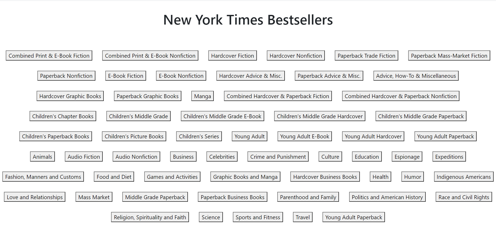
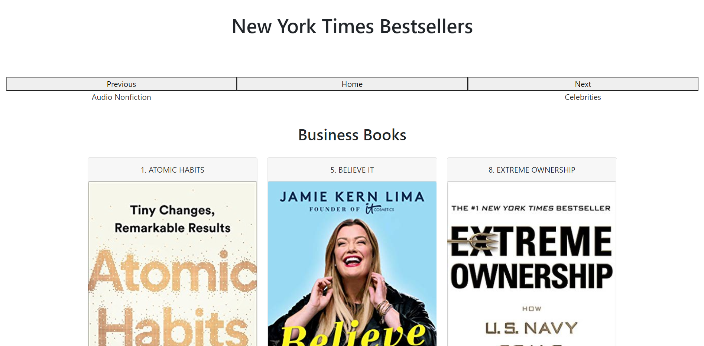
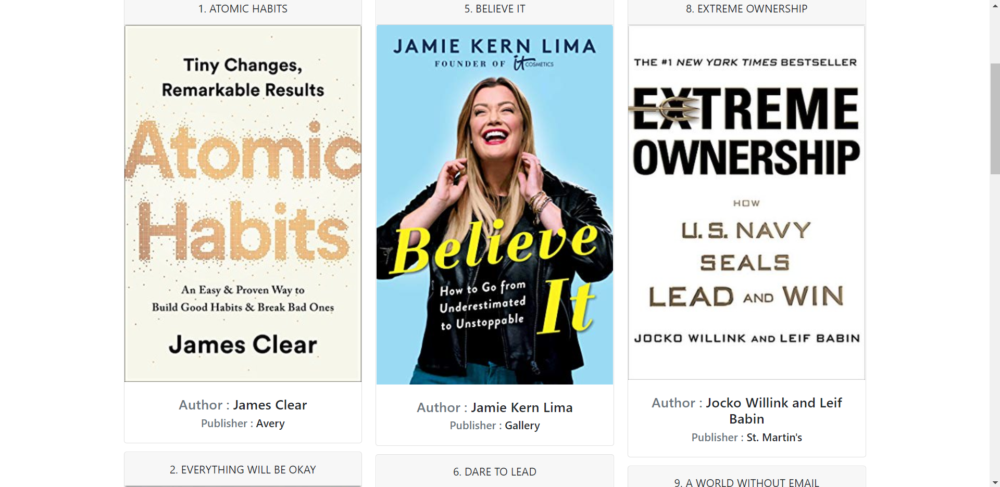

<h1>Client for New York Times Bestsellers API</h1>

Browse through all Categories of Bestsellers.

Browse through books on the bestseller list for the category you selected.

Move to previous or next category from your current selection.

<h2>Single Page App made with</h2>

React

React hooks : useReducer, useState and useEffect

Page 1: Home page

Page 2: Books for the category - Business books

Page 2, scrolled down

## Available Scripts

In the project directory, you can run:

### `npm start`

Runs the app in the development mode.\
Open [http://localhost:3000](http://localhost:3000) to view it in the browser.

The page will reload if you make edits.\
You will also see any lint errors in the console.
